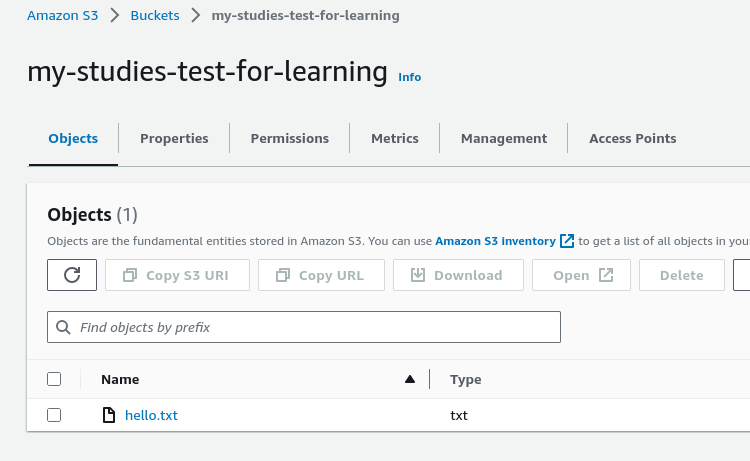

# AWS Bucket (s3) Demo

This repository is just a demo of creating IAM User (setting the policy and authentication) and managing a bucket.

First, you need to create an AWS account following this link (if you don't have one): [https://aws.amazon.com/resources/create-account/](https://aws.amazon.com/resources/create-account/)

# Zero Cost Budget

Now, with the account created, navigate to `Budgets` and `Create budget` and chose `Zero Spend Budget Template`:


# Create the IAM User

Enter in `IAM Dashboard` &rarr; `Users` &rarr; `Create user`. Now, type a username and select `Attach polices directly` and click on `Create Policy`. No `Policy editor` select the following checkboxes:

```
List -> ListBucket
Read -> GetObject
Write -> CreateBucket, PutObject
```

After selecting those checking boxes, mark the checkbox in `Resources` &rarr; `All`. Your `json` policy will be something like:

```json
{
	"Version": "2012-10-17",
	"Statement": [
		{
			"Sid": "VisualEditor0",
			"Effect": "Allow",
			"Action": [
				"s3:PutObject",
				"s3:GetObject",
				"s3:CreateBucket",
				"s3:ListBucket"
			],
			"Resource": "*"
		}
	]
}
```

Click em next, choose a good name for the policy, and create the policy.

Doing that, you can go to `Create user` and click on refresh and select the created police.


You now have an IAM User, click on the IAM user and go to the tab `Security credentials` &rarr; `Create access key`. I choose the options in the image below:


When you finish, just download the `.csv file` with the user and key. You can access a tutorial provided by the AWS [how to configure the authentication](https://boto3.amazonaws.com/v1/documentation/api/latest/guide/quickstart.html) if you want to understand better. I'm not using the [AWS CLI](http://aws.amazon.com/cli/).

I created in my system a file on this path: `~/.aws/credentials` and put my `Access key Id` and `Secret access key` that I downloaded before. You'll create the file like this:

```
[default]
aws_access_key_id = YOUR_ACCESS_KEY_FROM_CSV
aws_secret_access_key = YOUR_SECRET_KEY_FROM_CSV
```

I also created a `~/.aws/config` with the following content:

```
[default]
region=us-east-1
```

# Python Environment

You can find more information about Boto3 that is the AWS SDK for Python [here](https://github.com/boto/boto3).

- Create a new environment using your prefer environment manager and activate it:
 
```bash
$ python3 -m venv .venv
$ source .venv/bin/activate  # unix
```

- Install the dependencies:

```bash
$ pip install -r requirements.txt
```

- In your terminal, enter an interactive python interpreter (basically, typing python with the environment activated). Type the following commands:

```bash
>>> import boto3
>>> sts_client = boto3.client("sts")
>>> sts_client.get_caller_identity()
```

If returns something (response) without be an error, then you're authenticated. **Note:** this step is just to see if everything is alright. You can close the terminal.

# Run the demo script

Running the following command: `python demo.py` will create on AWS a bucket with the name specified and upload a file, as you can see below:




At the end of the script will download the file from AWS bucket created before and save as the name of `hi.txt`.

---
<div align="center">
  <strong>"PEOPLE'S DREAMS WILL NEVER END" - OP</strong>
</div>
<p align="center">
  <sub>Created by BrenoAV</sub>
</p>